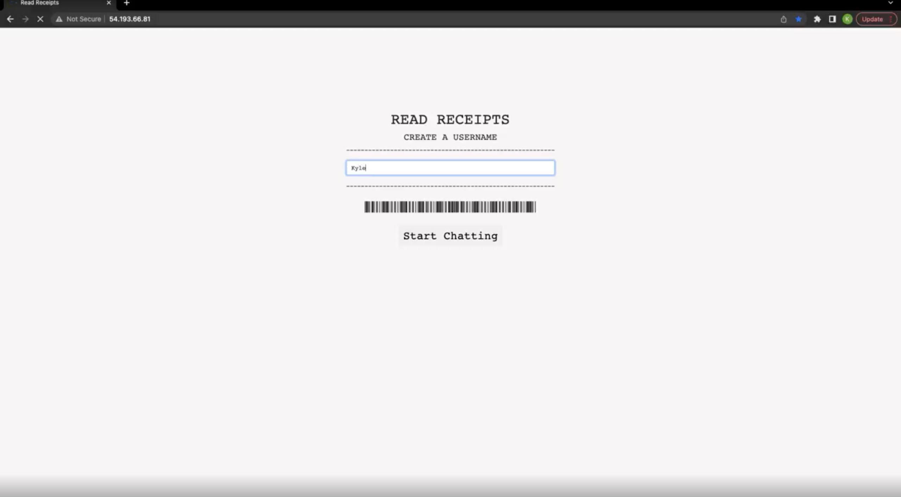

# read-receipts
> A receipt inspired chat application using Socket-io for users to communicate with each other working with Java and Spring Boot for backend applications.

> Live demo [_here_](http://18.144.173.58/). <!-- If you have the project hosted somewhere, include the link here. -->

## Table of Contents
* [General Info](#general-information)
* [Technologies Used](#technologies-used)
* [Features](#features)
* [Screenshots](#screenshots)
* [Project Status](#project-status)
* [Room for Improvement](#room-for-improvement)
* [Acknowledgements](#acknowledgements)
* [Contact](#contact)
<!-- * [License](#license) -->

## General Information
- Allows users to create a username and enter a chat room.
- When more messages come up the paper rises like a receipt.

## Technologies Used
- Spring Boot
- Web Sockets
- Java Server Pages
- Spring Tool Suite
- Apache Tomcat

## Features
- Ability to create a username
- Instant chat messaging

## Screenshots

<!-- If you have screenshots you'd like to share, include them here. -->

## Project Status
Project is: _in progress_ 

## Room for Improvement

Room for improvement:
- Having a long written message
- Save username in session when refreshing
- Use music video instead of livestream

To do:
- Ability to save messages and store them like receipts
- Have receipts be printable
- Edit username
- Change rooms

## Contact
Feel free to reach out!
Email: kyledeato@gmail.com

<!-- Optional -->
<!-- ## License -->
<!-- This project is open source and available under the [... License](). -->

<!-- You don't have to include all sections - just the one's relevant to your project -->
